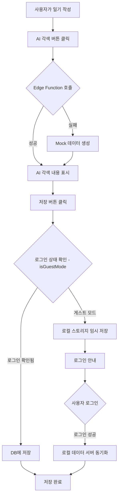

# Test-Driven Development (TDD) 문서

## 프로젝트 개요
AI 일기장 Flutter 앱의 테스트 전략 및 구현 문서

## 테스트 환경 설정

### 필요한 테스트 패키지
```yaml
dev_dependencies:
  flutter_test:
    sdk: flutter
  mocktail: ^1.0.0
  test: ^1.24.0
  integration_test:
    sdk: flutter
```

## 테스트 실행 명령어

```bash
# 모든 테스트 실행
flutter test

# 특정 테스트 파일 실행
flutter test test/diary_service_test.dart

# 구글 로그인 통합 테스트 실행
flutter test test/integration/google_login_diary_test.dart

# 커버리지와 함께 실행
flutter test --coverage

# 통합 테스트 실행
flutter test integration_test/
```

## 주요 테스트 케이스

### 1. AI 일기 저장 테스트 ✅

#### 테스트 시나리오
1. **AI 일기 생성 및 저장**
   - ✅ AI 일기 생성 후 저장 시 generated_content가 함께 저장되어야 함
   - ✅ 저장된 일기를 다시 불러올 때 generated_content가 유지되어야 함
   - ✅ 특정 날짜에 저장된 일기는 해당 날짜에 접근 시 보여야 함

2. **일기 업데이트**
   - ✅ updateDiaryWithGenerated 호출 시 generated_content만 업데이트되어야 함
   - ✅ 원본 내용(original_content)은 변경되지 않아야 함

3. **Mock 데이터 처리**
   - ✅ Edge Function 실패 시에도 Mock 데이터 반환되어야 함
   - ✅ 게스트 모드에서도 AI 일기 생성은 가능해야 함

#### 테스트 코드 위치
`test/diary_service_test.dart`

### 2. 인증 테스트

#### 테스트 시나리오
1. **구글 로그인**
   - ✅ 구글 로그인 버튼이 최상단에 표시되어야 함
   - ✅ 이메일 로그인은 제거되어야 함
   - ✅ 구글 로그인 후 사용자 정보 확인 가능해야 함

2. **게스트 모드**
   - ✅ 게스트 모드에서는 일기 저장이 실패해야 함
   - ✅ 게스트 모드에서도 AI 생성은 가능해야 함

3. **인증 상태 확인 로직**
   - ✅ `isGuestMode`가 실제 Supabase 인증 상태를 확인해야 함
   - ✅ `_supabase.auth.currentUser`가 null이 아니고 익명이 아니면 게스트 모드가 아님
   - ✅ 로그인된 사용자는 게스트 모드로 인식되지 않아야 함

### 3. 구글 로그인 + AI 일기 저장 통합 테스트 ✅

#### 테스트 시나리오
1. **전체 플로우 테스트**
   - ✅ 구글 로그인 → AI 일기 생성 → 저장 → 조회 전체 플로우
   - ✅ 구글 로그인 상태에서 여러 날짜의 일기 저장 및 관리
   - ✅ 구글 로그인 후 일기 업데이트 플로우

2. **예외 상황 처리**
   - ✅ 구글 로그인 없이 일기 저장 시도 시 실패
   - ✅ 구글 로그인 세션 만료 후 재로그인 및 일기 복구

3. **데이터 무결성**
   - ✅ 저장된 일기의 userId가 구글 계정 ID와 일치
   - ✅ AI 각색 내용(generated_content)이 저장 후에도 유지
   - ✅ 날짜별 일기 조회 시 정확한 데이터 반환

#### 테스트 코드 위치
`test/integration/google_login_diary_test.dart`

### 3. 구독 관리 테스트

#### 테스트 시나리오
1. **구독 상태**
   - ✅ "이전 구매 복원" 버튼 제거됨
   - ✅ 구독 서비스 준비 중 메시지 표시

### 4. 로컬 스토리지 및 동기화 테스트

#### 테스트 시나리오
1. **임시 저장 기능**
   - ✅ AI 일기 생성 후 로그인 전 로컬 저장
   - ✅ 로그인 확인 후에도 데이터 유지
   - ✅ `LocalStorageService`를 통한 임시 데이터 관리

2. **로그인 후 동기화**
   - ✅ 로그인 시 로컬 데이터 서버 동기화
   - ✅ 동기화 완료 후 로컬 데이터 정리
   - ✅ 동기화 실패 시 로컬 데이터 보존

### 5. 비밀번호 재설정 테스트

#### 테스트 시나리오
1. **PKCE Flow 지원**
   - ✅ `?code=` 파라미터 처리
   - ✅ `#access_token=` 레거시 flow 지원

## 일기 저장 플로우



## 테스트 데이터

### Mock DiaryEntry
```dart
final mockDiary = DiaryEntry(
  id: 'diary-123',
  userId: 'test-user-id',
  date: DateTime.now(),
  title: '오늘의 일기',
  originalContent: '오늘은 정말 좋은 하루였다.',
  generatedContent: 'AI가 각색한 아름다운 일기...',
  createdAt: DateTime.now(),
  updatedAt: DateTime.now(),
);
```

## 알려진 이슈 및 해결 방법

### 1. AI 일기 저장 문제
**문제**: AI로 각색된 일기가 저장되지 않음
**원인**: 게스트 모드에서 저장 시도
**해결**: 
- 로그인 상태 확인 로직 추가
- 게스트 모드에서는 로그인 안내 표시

### 2. 테스트 실행 시 Supabase 연결 오류
**문제**: 테스트 환경에서 실제 Supabase 연결 시도
**해결**: Mock 객체 사용으로 외부 의존성 제거

### 3. 로그인 상태에서도 "로그인이 필요합니다" 메시지 표시
**문제**: 로그인된 사용자가 게스트 모드로 인식됨
**원인**: `isGuestMode`가 내부 플래그만 확인하고 실제 인증 상태 미확인
**해결**: 
- `isGuestMode` getter 수정하여 실제 Supabase 인증 상태 확인
- `_supabase.auth.currentUser` 체크 로직 추가
- 익명 사용자와 실제 사용자 구분

## CI/CD 통합

### GitHub Actions 설정
```yaml
name: Flutter Tests

on:
  push:
    branches: [ main ]
  pull_request:
    branches: [ main ]

jobs:
  test:
    runs-on: ubuntu-latest
    steps:
      - uses: actions/checkout@v3
      - uses: subosito/flutter-action@v2
      - run: flutter pub get
      - run: flutter test
      - run: flutter test --coverage
```

## 테스트 커버리지 목표

- **Unit Tests**: 80% 이상
- **Widget Tests**: 70% 이상
- **Integration Tests**: 주요 사용자 플로우 100%

## 향후 추가할 테스트

1. **날짜별 일기 조회 테스트**
   - 캘린더에서 특정 날짜 선택 시 해당 일기 로드
   - 여러 날짜의 일기 목록 조회

2. **AI 스타일 선택 테스트**
   - 각 스타일별 Mock 데이터 생성 확인
   - 언어 자동 감지 테스트

3. **사용 제한 테스트**
   - 일일 10회 제한 확인
   - 제한 초과 시 안내 메시지

## 테스트 실행 및 모니터링

```bash
# 테스트 실행 및 결과 확인
flutter test --reporter expanded

# 특정 테스트만 실행
flutter test --name "AI 일기"

# 디버그 모드로 실행
flutter test --dart-define=DEBUG=true
```

## 유용한 테스트 도구

- **mocktail**: Mock 객체 생성
- **flutter_test**: Flutter 위젯 테스트
- **integration_test**: E2E 테스트
- **coverage**: 코드 커버리지 측정

---

*마지막 업데이트: 2025년 1월*
*담당자: Claude Code Assistant*